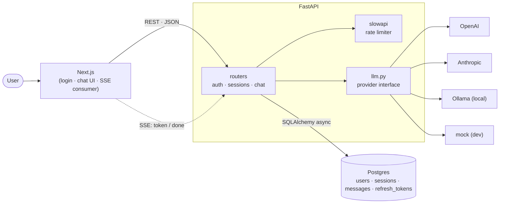

# ChatTemplate

A starter I use when I need to spin up a FastAPI + Next.js app that talks to an LLM. JWT auth, SSE-streamed chat, persistent sessions, Docker compose for local dev.

Mostly built for myself, since I keep rebuilding the same stack. Sharing it in case it's useful to anyone else.

## Use this as a template

Click **Use this template** at the top of the repo on GitHub to spin up a new project with this layout. Then update the names in `backend/pyproject.toml`, `backend/src/api/main.py` and `frontend/app/layout.tsx` to match your project.

## Stack

- Backend: FastAPI · Pydantic · SQLAlchemy 2 async · Alembic · asyncpg · slowapi
- Frontend: Next.js 15 · React 19 · TypeScript · Tailwind v4
- Database: Postgres 16
- LLM: OpenAI · Anthropic · Ollama · mock — all behind a single `chat/llm.py` provider interface
- Auth: JWT access tokens + opaque refresh tokens (rotation) · bcrypt
- Tooling: uv · pnpm · Docker · GitHub Actions · Husky

## Architecture



## Quickstart

### Docker

```bash
cp .env.example .env
# pick a provider: leave LLM_PROVIDER=mock for canned replies, or set
#   LLM_PROVIDER=openai    + OPENAI_API_KEY
#   LLM_PROVIDER=anthropic + ANTHROPIC_API_KEY
#   LLM_PROVIDER=ollama    + a running Ollama on OLLAMA_BASE_URL
docker compose up --build
```

- Frontend: http://localhost:3000
- API: http://localhost:8000
- Docs: http://localhost:8000/docs

### Host

```bash
docker compose up -d db

cd backend
uv sync
uv run alembic upgrade head
uv run uvicorn api.main:app --reload --port 8000

cd ../frontend
pnpm install
pnpm dev
```

## What's in here

- FastAPI app with health endpoint and lifespan
- JWT auth with refresh-token rotation: `/auth/register`, `/auth/login`, `/auth/refresh`, `/auth/logout`, `/auth/me`
- SSE chat endpoint: `/chat/{session_id}/stream`
- Persistent sessions: `/sessions` CRUD
- LLM providers: OpenAI · Anthropic · Ollama · mock — switch with `LLM_PROVIDER`
- Per-IP rate limiting via slowapi (auth and chat endpoints)
- Postgres schema via Alembic
- Frontend that auto-refreshes the access token on 401
- docker-compose with db + api + web
- CI (lint, format, test, build) + husky hooks (lint-staged, conventional commits)

## Git hooks

Conventional commits are enforced via [.husky/](./.husky/). After cloning, activate them once:

```bash
git config core.hooksPath .husky
```

`pre-commit` runs `eslint` on staged frontend files (via `lint-staged`) and `ruff check`/`ruff format --check` on staged Python files. `commit-msg` validates the conventional-commit prefix (`feat:`, `fix:`, `docs:`…).

## TODO

See [TODO.md](./TODO.md).

## License

MIT — see [LICENSE](./LICENSE).
